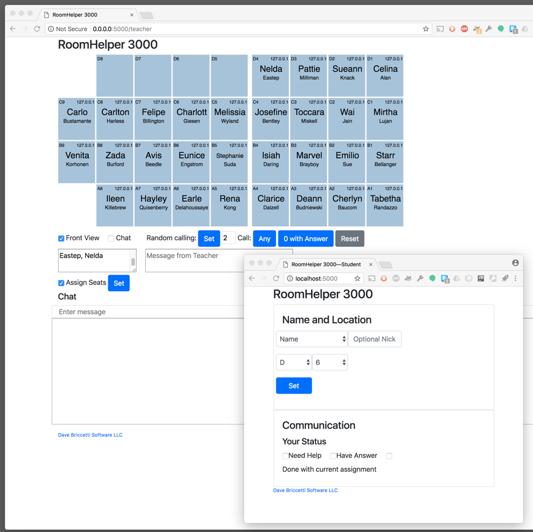

# RoomHelper 3000

A webapp to manage a class of students in a computer lab.

- shows where the students are sitting (from the teacher’s and the students’ perspective)
- lets the students indicate they need help, are done with the current task, or have an answer to the question being asked
- randomly chooses students from the entire class, or from just those who have indicated they have an answer
- shows the students the current task, or other message from the teacher
- gives realtime polls
    - short text
    - multiple choice
    - from 0 to 10
- allows the students to chat with each other (when the teacher permits it)
- allows sharing by students of links to approved domains
- provides a bell that rings on all the computers

Feature ideas:

- Log in with Google
    - Here’s a guide: https://fosstack.com/how-to-add-google-authentication-in-django/ . Is this a good way?
- Chat:
    - Delete all messages from a person
    - Disable chat for a person
- Make it easier to help students in order of them checking the box. Maybe a special marking for whoever is next. Perhaps this:
    - An assistant page that is like the teacher page, but with less
    power, and focused on helping kids in the order requested
- Remove confusion where students think they have to
push Set when they change checkbox settings
- Let the students pick their location by clicking on the seating
chart instead of by row and column
- Show poll results graphically à la Google forms
- Allow pre-loading poll questions
    - Paste them in, in some special format?
- Direct messages
- Transmission of live coding session to students
- Make the pre-seat feature work better
    - When they choose their name, set the row, col?
- Log poll questions and answers
- Color code the station boxes to reflect the degree of misbehavior of the student

Bugs:

- Can put arbitrary HTML in the chat
- Can assign <script> element to student name before sending a chat message
- The Russian translation of a student name can cause the
sketch to fail at rendering the stations

